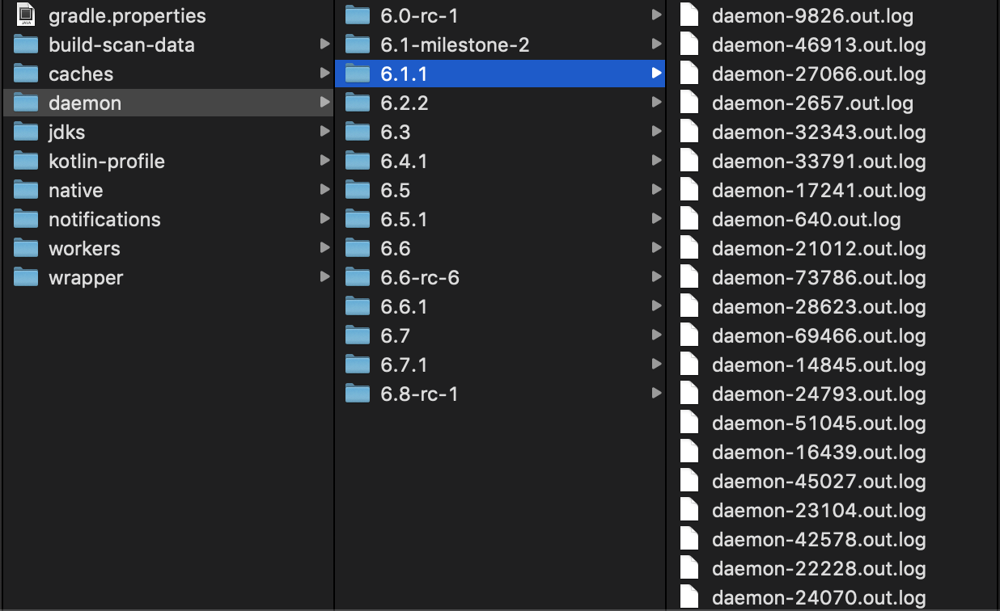

It was just another day of building my Android project on Macbbook when my build failed with a very strange error.
```
> A failure occurred while executing com.android.build.gradle.tasks.PackageAndroidArtifact$IncrementalSplitterRunnable
   > java.io.IOException: No space left on device
```

I checked Storage Manager and it showed me `16MB` of free space left. Welp!

I had suddenly run out of all my disk memory. Now I've had problems with my storage of my MacBook in past too but the situation never became this dire. To get things working fast, I removed all local docker images and caches to reclaim around 10GB of memory enough to get my work going.

I remained skeptical since then where is disk memory going, since I could not find anything suspicious in Storage Manager.

At this point I already know my usual culprits - docker images, emulator images, Android sdk platform sources but I had already optimised these few days ago so these definitely didn't cause any problem.

So I poked at my `.gradle` folder and found it's size to be `28GB`. 🤯

The first thought was to check downloaded library caches in `caches/modules-2/files-2.1`. It was around `1.5GB`, nothing suprising here.

So I decided to dissect the whole `.gradle` folder and try to find out where all the storage is going.

Guess what I found

`.gradle/daemon/` folder's size was ~`15GB`. All this folder had was log files!

But how did this happen.

Now this folder contains hundreds of log files for daemons spawned by different versions of gradle



Most of the log files in these folder are 1-2 MB or less. But then I found some log files whose size was ~1GB and even ~5GB!

 

Very suspicious!
## Travelling back in time ~ 1 month
Almost a month ago, one fine day I was hit with this error when I was trying to build my projects

```
Failed to execute org.gradle.cache.internal.AsyncCacheAccessDecoratedCache$2@1204453a.
java.lang.StackOverflowError
	at org.gradle.cache.internal.btree.FreeListBlockStore$FreeListBlock.alloc(FreeListBlockStore.java:222)
```

This error didn't really block my build, and since Android Studio trims down long outputs I never fully realised how many exceptions I was actually getting. This happened across multiple projects with different gradle versions over a course of few days.

I eventually found(though stackoverflow, ofcourse) that deleting `caches/journal-1` fixes this issue since it's cause by corruption of entries in this folder - `file-access.bin`, `journal-1.lock` and they are regenerated if not available.

From what I understand `journal-1.lock` is used by gradle cache and it's corruption was probably root of all exceptions.

Once I regenrated `caches/journal-1`, my builds started showing normal outputs.

Now back to problem at hand.

I guess you have figured out by now what those large log files contained. Lines and lines of this exception
```
java.lang.StackOverflowError
	at org.gradle.cache.internal.btree.FreeListBlockStore$FreeListBlock.alloc(FreeListBlockStore.java:222)
```

The largest log file had ~`49,000,000` lines of exception. Thank god, Sublime text didn't throw a StackOverflow error on opening it (pun intended)

I checked `./gradle/daemon` throroughly and found out 4 days of logs were consuming ~`10GB` of disk memory!

### Take care of your gradle home directory
and don't ignore errors in build like me 😅

Here are few more tips for optimising disk memory when it comes to gradle
- I'm a heavy user of Android Studio Canary, which means I have multiple installations of different gradle versions sitting in my machine.
By default `.gradle` folders bifurcates a lot of settings by gradle versions as separate folders. 
It's a good idea to poke around your `.gradle` folder routinely and delete what's not needed. I had folders for gradle versions as old as `4.10` which were not deleted.

- Gradle downloads and caches all wrapper distributions in `/wrapper/dists`. If you often juggle between rc/stable versions of Gradle, you can expect this to swell up as well. Also sometimes Android Studio suggests you to download gradle distribution with sources to inspect gradle script sources. You can avoid this unless you actually want to inspect sources of gradle script, otherwise `wrapper/dists` will have two copies of gradle wrapper(`-all` and `-bin`). `-all` distribution folders are usually 200+mb larger than `-bin` (multiply by number of versions you have on machine)

- If your builds have build cache enabled, you might want to look at `/caches/build-cache-1` too.
  
- Get a new macbook with more disk memory.

*Gradle is smart too*

I was pleasantly surprised that my `caches/modules-2/files-2.1` was only 1.5GB. This is because Gradle automatically cleans up library [cache, wrapper dists](https://docs.gradle.org/current/userguide/directory_layout.html#dir:gradle_user_home:cache_cleanup) and [build cache](https://docs.gradle.org/current/userguide/build_cache.html#sec:build_cache_configure_local) with time period of 7-30 days. Also Build cache can be cleaned by running `./gradlew cleanBuildCache`.

Unfortunately I believe this does not apply to log files([open issue](https://github.com/gradle/gradle/issues/8795)), since my log files were more than 30 days old and did not get deleted.

Fin.
