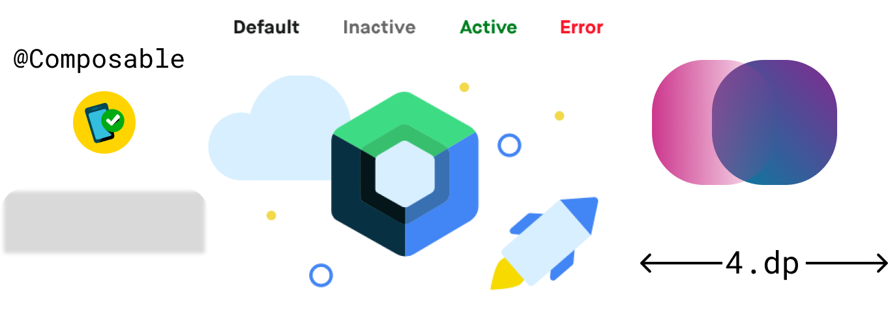

At my organization, we are heavy users of Design System across multiple apps and have built two iterations of our in-house design system in the last few years. Maintaining a Design System also meant finding creative ways to bridge the gap between Design Platforms(Sketch, Figma etc) and Mobile Platforms(Android, iOS). I've been experimenting with Jetpack Compose to rebuild our custom design system and this blog is a summary of what I found:

- [Design System Basics](#design-system-basics)
- [Working with Colors and Gradients](#working-with-colors-and-gradients)
- [Managing Typography](#managing-typography)
- [Spacings, Shapes and Shadows](#spacings-shapes-and-shadows)
- [Theming and CompositionLocal](#theming-and-compositionlocal)
- [Components](#components)
- [Backward Compatibility and Migration](#backward-compatibility-and-migration)
- [Final Thoughts](#final-thoughts)


## Design System Basics
A Design System represents the blueprint of an app's brand. Design cues often make an app recognisable, even when they are presented out of context. Consider logos of various brands and their color definition(Mcdonald's M with yellow color, Facebook's f with blue color).
A Design System makes sure your user doesn't feel alienated within your app as he traverses different flows of your product. Such a system is defined with very granular properties of Design: Colors and Typography with additional attributes such as shadows, shapes, spacings, gradients etc.

## Working with Colors and Gradients
A UI framework can be easily judged by the way it handles design primitive properties such as Colors. Android XML failed miserably at this because the only way you could represent color in it was hex code. The number of times I have received rgba properties from Designers and I had to ask them please provide hex codes because that's the only format we can support via XML, always felt stupid. Now don't get me wrong, hex codes are easy and there are ways to convert rgba to hex easily whether it's manual or automated, but it always made me feel I was speaking a different language than Designers.

Compose ditching XML means there is only one language left to define color which has a very good definition for the same.
```kotlin
//RGB with alpha
val color = Color(red = 0xFF, green = 0xFF, blue = 0xFF, alpha = 0xFF)
val color = Color(red = 1f, green = 1f, blue = 1f, alpha = 1f, ColorSpace.get(ColorSpaces.Srgb))

//ARGB Integer
val color = Color(0xFF000080)
```

**Gradients**

If you want to standardize gradients in your app, it's hard. Here are few ways to create gradients in Android
- If you have a Vector, you can add a `<gradient>` tag inside xml. Want to do this outside of xml, forget it.
- Above step is same if you have an Shape xml.
- You can create `GradientDrawable` programmatically, but it only takes specific shapes like `oval`, `rectangle` etc.

Creating a central API to create/apply gradient with a shape/drawable is hard. The only way is to convert the whole Drawable to Bitmap, add shader to it and bam you get back gradient laden `BitmapDrawable`(YOLO)

Better ways are here. Compose abstracted away everything related to `Drawable` to `Painter` classes(This also helps avoid all issues with Drawables in general but that probably needs a different blog post).

Similar to `Color`, Compose has a `Brush` API which allows you to define how to paint the content. The API is very generic since you can create a `Brush` instance for Gradient or a Solid Color, very handy for creating an API where you don't know whether the consumer of your component would apply a Solid Color or a Gradient.

`Shape` class allows you to define shapes as well without any correlation with how the shape will be painted.

```kotlin
Modifier.background(
    brush = Brush.linearGradient(listOf(startColor, endColor)),
    shape = CircleShape
)
```
By creating an extension on `Modifier`, this allows us to create a central API for applying design specific gradients abstracting out properties like angles, stops etc from end users.

## Managing Typography
I've been developing applications since before xml support was added for font files. Before that, it was a constant effort around `Typeface` APIs to make sure custom fonts were managed and applied properly everywhere(Do you even *Calligraphy* bro 😛 ). 

Ever since fonts got support for xml, managing styles for `TextView` was far better. The existing system still suffers from certain hiccups
- Setting styles programmatically using `setTextAppearance` does not respect line height.
- Classes like `EditText` subclass `TextView` and can apply the same styles. However line height behaviours are quite inconsistent when fields are editable, which even varies with API level or how your custom font defines it's line height or even how many lines your editable is rendering.

Compose uses `TextStyle` to define a style which can then applied `Text` related composable functions

```kotlin
TextStyle(
    fontFamily = Font(R.font.maison_neue_book).toFontFamily(),
    fontSize = 12.sp,
    lineHeight = 16.sp,
    color = Color(0xFFFF323D)
)
```
`TextStyle` supports a variety of properties `fontSynthesis`, `letterSpacing`, `baselineShift` etc. I wasn't even aware such things were possible until I looked at these classes😅

`Spannable` is now known as `AnnotatedString` which accepts `SpanStyle` and `ParagraphStyles`.

The larger improvement here is `Text` is text, it's no longer a base class for `Button`, `EditText` (Composition over inheritance). Editable and Clickable behaviours are represented with different composables functions or Modifiers. 

## Spacings, Shapes and Shadows
**Spacings**

Compose introduces two new classes `androidx.compose.ui.unit.Dp` and `androidx.compose.ui.unit.Px` to define measurements. Spacings can be mapped using plain objects or classes depending whether they are theme dependent or not.

```kotlin
object Spacing {
    val spacingX = 4.dp
    ....
}
```

**Shapes**

Compose has its own `Shape` interface which can be used to define custom shapes. Concrete implementations are available such as `CircleShape`, `RoundedCornerShape`, `CutCornerShape` etc.

**Shadows**

```kotlin
Modifier.shadow(elevation = 4.dp, shape = RoundedCornerShape(4.dp))
```

Since Compose uses Android's canvas to draw shadow, support for colored shadows is not possible. Fake colored shadows can be drawn on canvas using `Canvas` composable.

## Theming and CompositionLocal
Traditionally Android's theming system is heavily dependent on XML. We would usually have a style file called `AppTheme` which is applied at an application or activity level and it would define all attributes such as colors which are used by layouts in XML.

The Android framework takes care of loading styles from `AndroidManifest.xml` and the loaded theme is stored inside the currently applicable `Context`. A simple example is when using light/dark theme you would traditionally use `activity.setTheme` and after that all layouts inflated can automatically query attributes which were defined in the theme.

Compose doesn't follow such a mechanism because all properties around colors, typography and spacings are defined in Kotlin classes and not linked to `Context`.

Enter `CompositionLocal` (also known as Ambients previously).

`CompositionLocal` in a simple definition, is a Service locator which can be used to store and retrieve arbitrary values. But they come with goodies, when values inside these locals change Compose will trigger UI update(think dynamic theming without activity restart). 
Since they are kind of Service Locators, it's easy to shoot yourself in the foot with them due to lack of compile time checks. However they are extremely useful to define and store theme related data.

```kotlin
internal val LocalTypography = staticCompositionLocalOf { greenThemeLightTypography() }
internal val LocalColors = staticCompositionLocalOf { greenThemeLightColors() }
internal val LocalSpacing = staticCompositionLocalOf { greenThemeLightSpacing() }
```

`CompositionLocal` can be created using `staticCompositionLocalOf` or `compositionLocalOf`. The former should be used when you expect values inside them to be changed less often, which is true for themes since you might not expect themes to change very often(day/night).

Once we have a way to retrieve properties from locals, we can wrap them into a top level composable which would intialise these locals and its children would be our UI content.

```kotlin
fun AlohaTheme(
    currentTheme: AlohaThemeToken = AlohaThemeToken.GREEN_THEME_LIGHT,
    content: @Composable () -> Unit
) {
    val (alohaTypography, alohaColors, alohaSpacing) = when (currentTheme) { /*Logic to return types according to theme*/ }
    CompositionLocalProviders(
        LocalTypography provides alohaTypography,
        LocalColors provides alohaColors,
        LocalSpacing provides alohaSpacing
    ) { 
        content() 
    }
}

// Expose types
val AlohaColors 
    @Composable get() = LocalColors.current

// Application UI
setContent {
    val currentTheme = remember { mutableStateOf(AlohaThemeToken.GREEN_THEME_LIGHT) }
    AlohaTheme(currentTheme = currentTheme.value) {
        // UI which can access colors using AlohaColors,
        // typography using AlohaTypography
    }
}
```

`CompositionLocalProviders` allows us to set values to `CompositionLocals`. Since our theme properties like `Typography`, `Color` and `Spacing` can change according to theme we use `provides` to bind values to `LocalTypography`, `LocalColors` and `LocalSpacing`. So if a composable requests current colors using `LocalColors.current`, it will receive color according to theme.

## Components
If we take a look back at traditional Android UI, the framework provided a lot of customisable components such as `Button`, `EditText` and even more like `RecyclerView`, `Card` were provided via AppCompat. One of the behaviour common in a lot of these components was they were themed according to what theme OS was applying. For example a `Button` would look wildly different depending on which OS it was being rendered. For `MaterialTheme`, this was advently solved by MDC components which followed material guidelines irrespective of OS versions on which they were being rendered.

Compose builds components on the same concept where components are separated by a design layer defined by `foundation` and `material` packages.


UI components within the Compose framework are divided into classes which make no assumptions around Theming such as `BasicText` and classes such as `Text` which expose `LocalTextStyle` as a `CompositionLocal` allowing them to be themed. This can be compared to color attributes such as `colorControlActivated` which we would use in traditional framework components such as `Switch` to theme it.

**To Material or not**

Since compose separates out Material components, if you try to build a Custom Design system with just `foundation`, the only components you will find yourself with are `BasicText`, `BasicTextField` and layout functions. Any other component like `RadioButton`, `CheckBox`, `Switch` etc will have to be built with scratch which is a departure from current situation where you could create custom versions of such components using `AppCompatRadioButton`, `AppCompatCheckBox`, `SwitchCompat` etc.

While this might look like a hiccup, it presents a larger question to creators of Custom Design System - whether you should accept Material behaviour inside your Design System. You can always *compose* a new Design System on top of `MaterialTheme` composable which would then allow you to create custom components as well as use existing Material ones. [Here's an example in Jetsnack sample](https://github.com/android/compose-samples/blob/main/Jetsnack/app/src/main/java/com/example/jetsnack/ui/theme/Theme.kt#L81)

Material components use `CompositionLocal` heavily to define elevations, content colors as well as Interaction states are defined when `MaterialTheme` composable is initialised. While most of these properties and behaviours can be overridden, it must be understood these components have a default behaviour which is based on Material guidelines. If you have a Design System which defines custom interactions apart from colors and typographies, this is something which you should keep in mind if you *compose* your design system on top of Material's implementation.

## Backward Compatibility and Migration
While Compose is definitely an exciting new way to build UI, our existing traditional views are not going anywhere(probably for years!). Hence we must find a way to reuse existing styles and components wherever needed.

**Theme**

Material has an excellent example for keeping themes backward compatible using an [adapter](https://github.com/material-components/material-components-android-compose-theme-adapter). This allows you to keep xml styles as source of truth and very useful if the UI screen is mix and match of both Traditional views and Compose UI Components.

**Components**

Existing view components can be converted to Composables using `AndroidView` composable.

```kotlin
@Composable
fun AlohaCheckBox(
    isChecked: Boolean,
    isEnabled: Boolean = true,
    onChecked: (checked: Boolean) -> Unit
) {
    AndroidView(factory = { context ->
        val alohaCheckBox = AlohaCheckBox(context = context) // Traditional UI view themed via style applied at activity/fragment level
        alohaCheckBox.isChecked = isChecked
        alohaCheckBox.isEnabled = isEnabled
        alohaCheckBox.setOnCheckedChangeListener { _, checked -> onChecked.invoke(checked) }
        return@AndroidView alohaCheckBox
    })
}
```

This provides a clear migration path for components since you can start off with re-writing components which can take advantage of Compose's state management system and retrofit other components using `AndroidView` to be migrated later. `AndroidView` wrapped components can still define their APIs using a `@Composable` function whereas their underlying implementation can change later.

## Final Thoughts
I had a lot of fun migrating our Design System to Compose. It definitely solves a lot of problems around abstractions and dynamic theming which plague the current theming system in Android. Compose's modern nature is complemented by the fact that it's APIs are named in such a manner, if you've used React, Bootstrap etc you might feel at home with concepts like `Alignment`, `Arrangement` etc and state management. There might remain a lot of unanswered questions as developers implement this framework in their apps but overall the experience should be refreshing!

