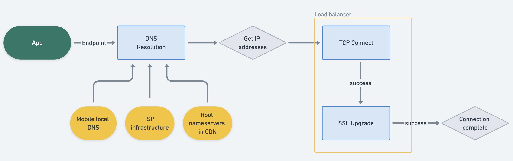
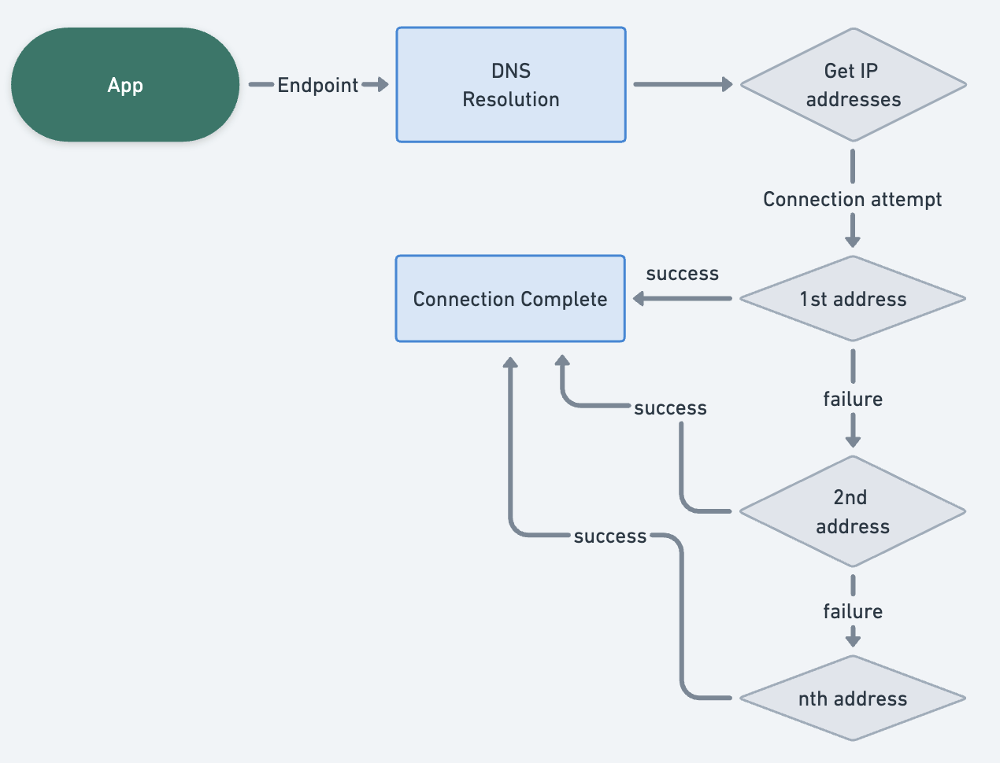
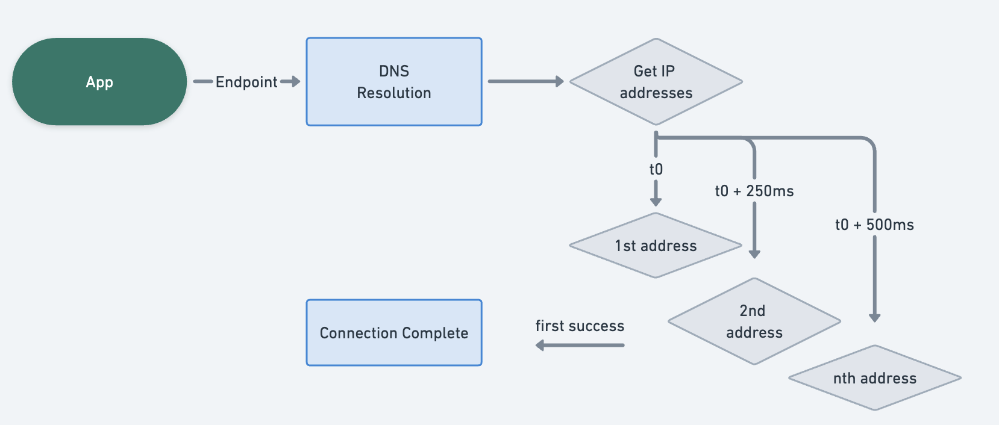
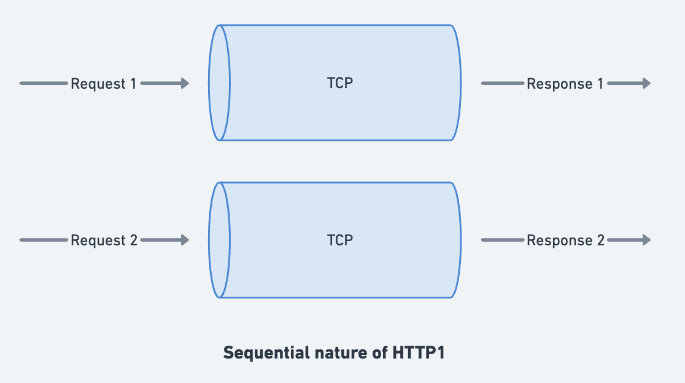
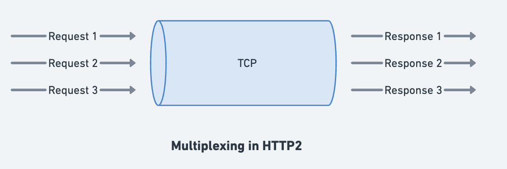

I recently learned about spread spectrum technology - a communication technique developed decades ago that works by hopping signals across frequencies to improve reliability. What started as a way to make military communications jam-resistant eventually led to CDMA and the cellular networks we rely on today. The entire journey of how a communication signal travels is quite fascinating, and equally complex and deep when performing a simple thing such as a network call on mobile.

A simple HTTP request might seem straightforward, but under the hood, it's a complex dance between your device, cellular towers, ISPs, and data centers. Each step in this chain can introduce latency, failures, or performance bottlenecks. Through real-world experimentation and production deployments, I've discovered several low-level optimizations that can dramatically improve network reliability and performance.

## The Network Call Journey

Before diving into optimizations, let's understand what actually happens when your app makes a network request:



Each of these stages can fail or introduce delays. In a world of cellular networks, WiFi handoffs, and varying signal strengths, optimizing each step becomes crucial for a smooth user experience.

## It's always DNS

DNS resolution is often the forgotten stepchild of network optimization, but it can easily add 50-200ms to the first request to a new domain. Here's what actually happens during DNS resolution:

**DNS Resolution Stages:**
1. **Local Cache Check** - Device checks its DNS cache
2. **System Resolver** - Query the system's configured DNS server
3. **Recursive Resolution** - DNS server queries root servers, TLD servers, authoritative servers
4. **Response Propagation** - Result travels back through the chain

Each of these stages can fail or be slow, especially on mobile networks where packet loss is common.

### DNS Subtleties That Kill Performance

- **Cache Invalidation**: Low TTL can mean, devices need to resolve DNS frequently which might occur over unreliable or low-bandwidth paths.
- **Network Switching**: Moving from WiFi to cellular (or vice versa) or fluctuations can clear DNS cache

### Optimizing DNS
DNS can be optimized depending on your configurations. For eg. if you have static IPs, you can probably cache them for a longer time and refresh them asynchronously within your app.

If IPs are dynamic, it's probably not safe to cache them for a longer time but you can try to reduce errors by using a cached or a different static IP in case primary resolution fails.

`okhttp` allows you override DNS lookup which you can attach to your `Builder`

```kotlin
class CustomDns : Dns {
    
    override fun lookup(hostname: String): List<InetAddress> {
        // With static IPs, check cache with a bit more relaxed expiry
        val cached = getCachedAddresses(hostname)
        if (cached != null) return cached
        
        return try {
            // Fallback to system DNS
            val addresses = Dns.SYSTEM.lookup(hostname)
            addresses
        } catch (e: UnknownHostException) {
            // With dynamic IPs, try to fallback to preconfigured static IP
            getStaticAddresses(hostname) ?: throw e
        }
    }
    
    private fun getStaticAddresses(hostname: String): List<InetAddress>? {
        return when (hostname) {
            "api.myapp.com" -> listOf(InetAddress.getByName("x.xx.xxx.xx"))
            else -> null
        }
    }
}
```
Depending on whether your objective is reliability or performance, overriding DNS resolution can be useful if you have users facing latency or connectivity challenges. I'll discuss later in the article, how to identify these issues.

## IP addresses can deceive

DNS returns IP address(es), to one of which a connection must be made. Most modern servers will publish multiple IP addresses which can be often used as means of load balancing or handling requests from different geographies.

Often these are combinations of IPv4 and IPv6, where lies our next challenge.

**The Problem:**
IPv6 was launched more than a decade ago, to address (pun intended) exhaustion of IPv4 addresses. Like all large-scale migrations, its quirks are still felt today

Today largely all servers would support IPv6+IPv4, where IPv6 is preferred if available via AAAA record. The clients will prefer the same if they themselves support IPv6 along with a connected network.
Here lies the problem, there are many layers between client, their nearest network and servers which may not be configured for IPv6.

**Connection Flow (Traditional):**



The major challenge here is that if you have multiple IPv6 addresses, which are non-functional for certain users, there will be multiple attempts with timeouts (typically 10-15 seconds), before you actually get a connection success, leading to overall latency of 30-60s.

### Fast Fallback Algorithm

The solution is [Happy Eyeballs (RFC 8305)](https://datatracker.ietf.org/doc/html/rfc6555) - make parallel connection attempts to all available IP addresses and return the fastest successful connection.

**Optimized Connection Flow:**



Thankfully most modern clients support this internally. Chrome, Firefox, even iOS `UrlSession` enable it by default.

In OkHttp, you can enable this with(default since v5.0):

```kotlin
val client = OkHttpClient.Builder()
    .fastFallback(true)
    .build()
```

#### The Hardware Reality
I faced the above problem, when using a different [client](https://github.com/nats-io/nats.java) for networking needs than `okhttp`, where we would find some users running into persistent disconnections over IPv6 addresses.
While clients attempting to connect to IPv6 have been informed by network to use it, the underlying network isn't actually ready for these addresses. This is largely due to :
- Cellular tower configuration issues
- ISP routing problems  
- Corporate firewall policies
- Home router misconfigurations

We later figured out that **~5%** users can't connect to IPv6, even when DNS resolves it for them and end up connecting to IPv4 addresses.

## Making attempts faster

Clients often come up with a default set of values around timeouts, optimisations which might be counterintuitive in certain use cases. For example, `okhttp` has
- Default timeout of 10s for connections
- Default timeout of 10s for read/write requests.
- Max 5 concurrent calls per host, while limiting it to 64 globally.

Increasing concurrent calls per host might be worth it if all calls use the same host, which can be the usual case for mobile apps.

In terms of timeout, it might be worth experimenting if failing fast with lower timeouts helps with app experience. It also forces you to look at your own infrastructure in terms of what you need to change to reach users in let's say <5 seconds.

Another advantage here is faster timeouts can capture degraded TCP connections faster. Let me take an HTTP detour to expand on this.

### HTTP 1 & 2
HTTP 1 makes requests over connection sequentially, which means if one request is slow, all others in line become slow as well. This can be mitigated by creating a bunch of connections and splitting requests over them.

HTTP2 solves this by multiplexing requests over a single connection as different streams, which can be dispatched and returned in any sequence.



 

The only blocker here is the TCP connection here itself, since TCP acknowledges every packet sent, a packet loss at any request will pause all request streams until lost packet is retrieved. Packet loss is more prevalent in fluctuating mobile networks.

Shorter timeouts can force clients to revalidate their connection [health](https://github.com/square/okhttp/blob/4e7860212f3d873b37b69e4f0a882cf60bb91dd7/okhttp/src/commonJvmAndroid/kotlin/okhttp3/internal/http2/Http2Connection.kt#L530) faster, upon which you can fail fast and retry on a newer (hopefully better) path when the network is fluctuating.

**Timeout Strategy:**
```kotlin
val client = OkHttpClient.Builder()
    .connectTimeout(10, TimeUnit.SECONDS)
    .readTimeout(5, TimeUnit.SECONDS)
    .build()
```

**Parallel Connection Limits:**
```kotlin
val dispatcher = Dispatcher()
dispatcher.maxRequestsPerHost = 10

val client = OkHttpClient.Builder()
    .dispatcher(dispatcher)
    .build()
```

## HTTP3: Return of UDP

HTTP/3 uses [QUIC](https://www.chromium.org/quic/) protocol, which runs over UDP instead of TCP. This solves several fundamental issues with TCP:

**TCP Problems QUIC Solves:**
- **Head-of-line blocking**: One lost packet blocks all streams
- **Connection setup**: Requires multiple round trips
- **Mobility**: Connections break when switching networks

**Mobile-Specific Advantages:**
- **Connection Migration**: Maintains connection when switching from WiFi to Mobile
- **Better Loss Recovery**: Per-stream recovery instead of connection-wide
- **Reduced Latency**: Built-in encryption, no separate TLS handshake

Unfortunately, `okhttp` doesn't support HTTP3 natively, but we can use Google's [Cronet](https://developer.android.com/develop/connectivity/cronet) library, which can also plug into `okhttp` stack but with limited [features](https://github.com/google/cronet-transport-for-okhttp).

## Measurement
If using `okhttp` , you can attach an `EventListener` to the `Builder`, which can then be used to measure different stages of http calls.
```kotlin
class MetricsListener : EventListener() {

    override fun callEnd(call: Call) {
    }

    override fun callStart(call: Call) {
    }

    override fun connectStart(call: Call, inetSocketAddress: InetSocketAddress, proxy: Proxy) {
    }

    override fun connectEnd(
        call: Call,
        inetSocketAddress: InetSocketAddress,
        proxy: Proxy,
        protocol: Protocol?
    ) {
    }

    override fun dnsStart(call: Call, domainName: String) {
    }

    override fun dnsEnd(call: Call, domainName: String, inetAddressList: List<InetAddress>) {
    }

    override fun secureConnectStart(call: Call) {
    }
    
    override fun secureConnectEnd(call: Call, handshake: Handshake?) {
    }
}
```
`EventListener` is quite extensive, and can be used to get metrics around cache hit, dns, SSL and much more. You can push these metrics to your favorite analytics/observability system and analyze patterns around carrier, geography etc.

## Conclusion

Just like spread spectrum technology spread signals across multiple frequencies to survive interference, modern mobile apps need to spread their bets across multiple optimization strategies. DNS caching handles resolution failures, fast fallback survives IPv6 connectivity issues, aggressive timeouts help recover from degraded connections, and HTTP/3 promises to solve fundamental TCP limitations.

The network will always be unreliable - that's the one constant we can count on. But by understanding each stage of the network journey and optimizing for the realities of mobile communication, we can build apps that feel fast and reliable even when the underlying infrastructure isn't.

Next time a user complains about network performance, you'll know it's not just "the network is slow" - it's a complex chain of optimizable steps waiting to be fine-tuned.

