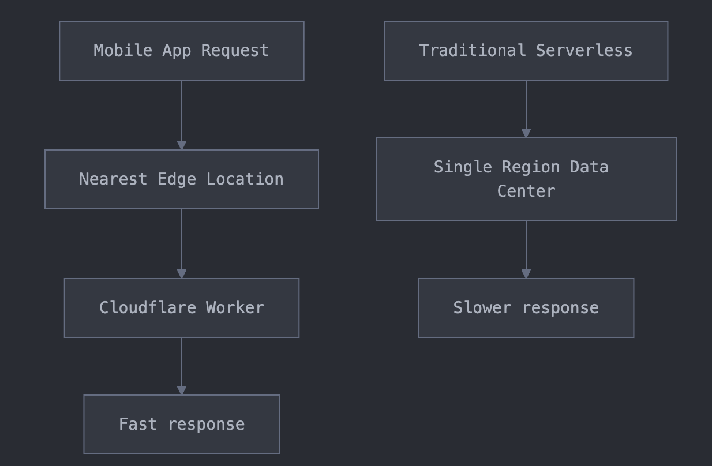
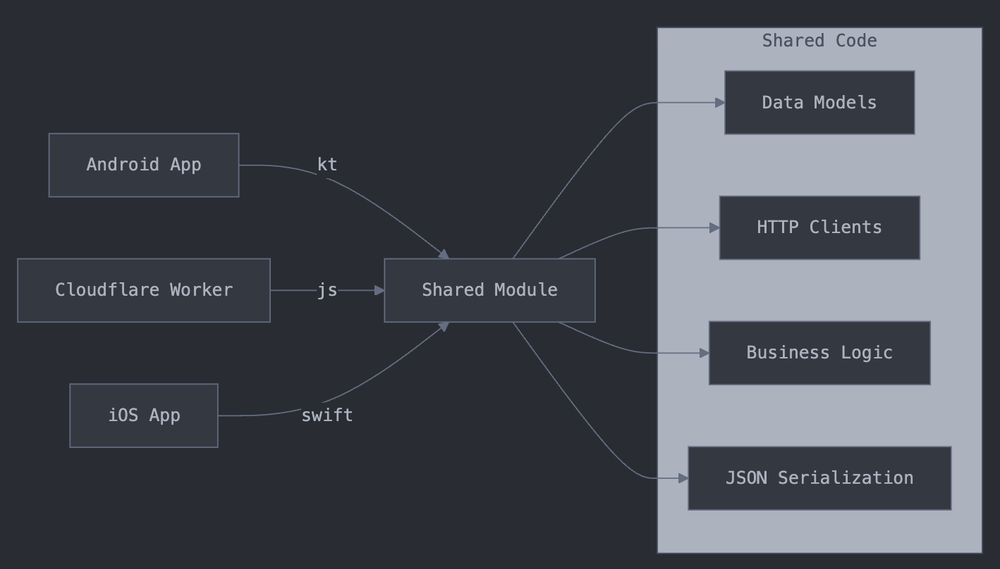

What if your serverless functions and mobile apps could share the same code — models, network logic, and business rules — all in one place?
At work, we’ve been using Cloudflare Workers for a while, and I recently decided to try building them in Kotlin using Kotlin Multiplatform. The result: a unified codebase powering both our edge functions and mobile applications, with no duplicated logic.

## Workers and Edge Computing

Cloudflare Workers allow you to run serverless functions across a globally distributed network, choosing the location closest to the user (possibly even in their city).
Instead of routing everything to a single server in one location, your functions run where they’re needed, reducing latency and improving performance.

Workers also provide built-in integrations such as:
- Key-Value storage
- Databases



## Workers Runtime
Workers run on WebAssembly (WASM), a portable and high-performance binary format that can be compiled from various languages.

This opens the door for Kotlin/JS — Kotlin code compiled to JavaScript (and eventually running inside WASM).
We get to keep Kotlin’s strong type system, coroutines, and familiar APIs, while targeting the Cloudflare Workers runtime.

Example Worker entrypoint in Kotlin:
```kotlin
@JsExport
fun fetch(request: Request, env: dynamic = null, ctx: dynamic = null): dynamic {
    return GlobalScope.promise {
        handleRequest(request, env, ctx)
    }
}
```

## Sharing code with KMP

Because the whole setup uses Kotlin, we can share a significant amount of code between mobile and edge environments, including:

- HTTP client (ktor)
- Serialization (kotlinx.serialization)
- Request/Response models
- Business rules and validation logic

This means the same Kotlin models that your Android/iOS app uses can also be used in your Workers, ensuring consistency and 
eliminating duplication.



## Inferencing AI models at edge

Cloudflare’s AI Workers integration takes edge computing further by allowing AI inference directly at the edge.
Imagine parsing a request, running an LLM, and returning a result — all without leaving the nearest Cloudflare PoP.

Here’s an example of calling an AI model from Kotlin:
```kotlin
suspend fun handleAIRequest(env: dynamic, request: AIRequest): Response {
    val prompt = """
        Provide one paragraph information about ${request.url}
        Response should only contain text and should give brief about conference
        topics, speakers and location.
    """.trimIndent()
    
    val aiResponse = env.ai.run("@cf/meta/llama-3-8b-instruct", promptObject)
        .unsafeCast<kotlin.js.Promise<dynamic>>()
        .await()
    
    return Response(Json.encodeToString(aiResponse), ResponseInit(headers = headers))
}
```
The same code handles HTTP parsing, AI model execution, and response formatting — all at the edge, with minimal latency.

## Tradeoffs

While Kotlin/JS works well with JavaScript, there are considerations:

- ES module export — Workers require ESM; setup can be tricky.
- Bundle size — Kotlin/JS output may be larger than handwritten JS.

That said, if your team already uses Kotlin Multiplatform, this approach delivers huge code reuse and consistency wins.

*The complete source code and detailed setup instructions are available in my [KotlinWorker repository](https://github.com/jitinsharma/kotlinworker)*