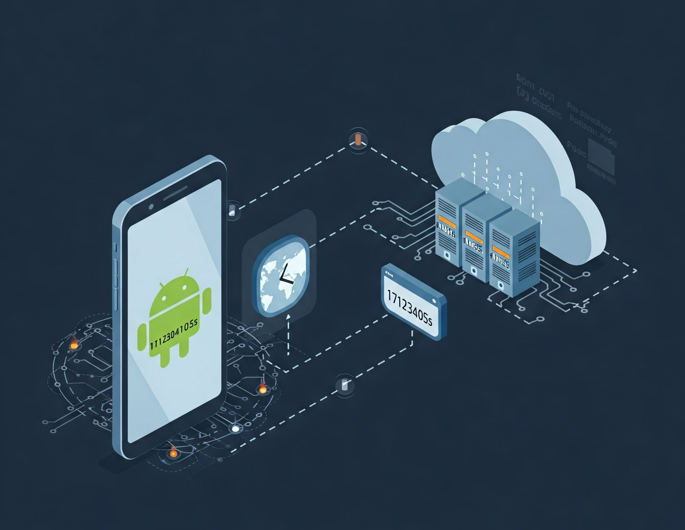

My alarm clock regularly wakes me up at 6am or 06:00:00 to be exact. Time is a surprisingly variable concept. Atomic clocks define absolute precision, but in everyday life — like my alarm going off at 6:00 AM — a few seconds rarely matter.

At work, I often have to deal with a bit more precise time since certain logical steps in mobile apps determine certain actions users can take. This led me to a rabbit hole of how time is determined on Android.

## What is current time

`System.currentTimeMillis()` will return time in epoch format based on the device's current time. Accuracy of such is important in cases when some steps must be taken based on it, which are not validated on server, such as

* Batch Processing of data  
* Adding timestamp to an event, which might be compared to backend timestamp.  
* Enabling logic based on time of day (Example \- stock market opening/closing on 9.15am/3.30pm)

Unfortunately current time can be flawed based on

* User changing time and date  
* Drift in automatic time

## Automatic time

When automatic time is enabled in device settings, Android devices synchronize their internal clock using NITZ(Network Identity and Time Zone), NTP(Network Time Protocol) or GPS. From Android 12, NTP is preferred way of synchronizing time.

#### NITZ
This data is broadcasted by cellular networks on periodic basis and received by Android OS's Radio Interface Layer, which then synchronizes internal clock. Unfortunately, the value in broadcast is not guaranteed and different cellular network may return different values, based on how they are maintaining their own clock.

#### NTP
NTP uses servers which are geographically distributed systems, from which devices can sync timestamps. In general, even outside of mobile devices, this is considered best approach to sync time.
For Android, `time.android.com` is AOSP’s default server which is also duplicated across geography. But this itself has certain limitations

* The device needs to compensate for the return trip time of the network call made to the NTP server, Android already does that but under assumption both legs of round trip take equivalent time and that difference is adjusted ([source](https://cs.android.com/android/platform/superproject/main/+/main:frameworks/base/core/java/android/net/SntpClient.java;drc=61197364367c9e404c7da6900658f1b16c42d0da;l=229?q=Sntp)).  
* The default sync interval is 18 hours.  
* Request to NTP server times out at 5 seconds, post which 3 retries will happen.  
    
All of these configs are overridable by OEMs/Carriers and they often are so this itself might vary across manufacturers/carriers.  
Example \- Some manufacturers prefer using local NTP servers like `in.pool.ntp.org` for India.  
Fun fact: Most of these servers have no SLAs for downtime 🤭

#### GNSS
Satellite orbiting earth have atomic clocks which can send [current time](https://cs.android.com/android/platform/superproject/main/+/main:frameworks/base/services/core/java/com/android/server/timedetector/GnssTimeUpdateService.java;l=212;drc=61197364367c9e404c7da6900658f1b16c42d0da;bpv=0;bpt=1?q=GnssTimeUpdateService&ss=android%2Fplatform%2Fsuperproject%2Fmain) along with location data when requested. These are highly accurate values, but available only when you have an active GPS signal.

## Source of drift

Backend services use their own NTP servers to capture timestamps, for example GCP uses `metadata.google.internal` as its NTP server. While both `time.android.com` and `metadata.google.internal` synchronize to Google's authoritative time sources aiming for UTC, but this will rarely translate to client-backend timestamps since for a mobile client there is a factor of network latency, user settings and OEM overrides, where as backend VMs would be querying NTP over an internal network.

In production, I've regularly seen a couple of seconds of drift between client and server — even with automatic time enabled. And if the user manually adjusts their clock? All bets are off.

For most of the use cases, this doesn’t cause any issue 😅unless you have a time critical action to be executed at client without server validation (allow placement of orders, diffing frontend/backend latencies etc)

## Catch my drift!

So what’s the solution, needless to say in general you should never trust the client, otherwise time drift will be the least of your problems. For other use cases

* Google now has a nice Trusted Time API which you can use ([https://android-developers.googleblog.com/2025/02/trustedtime-api-introducing-reliable-approach-to-time-keeping-for-apps.html](https://android-developers.googleblog.com/2025/02/trustedtime-api-introducing-reliable-approach-to-time-keeping-for-apps.html) )  
* You can deploy your own time service, potentially hosted regionally or on a CDN edge node to minimize latency for your clients, and use its timestamp consistently within your app.

## Fin
TL;DR time is hard

Further reading on NTP: [https://developers.google.com/time](https://developers.google.com/time)

If you’re ever in London, don’t miss the Greenwich time museum to learn the history of clocks and time itself.

