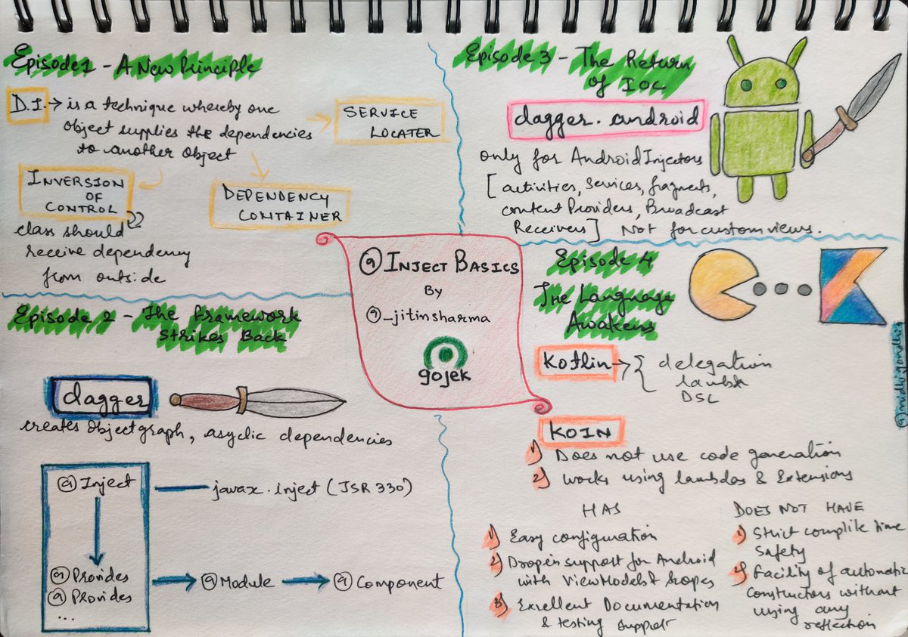

Dependency Injection is a concept which has become quite popular among Android developers as our applications break barriers on features and at the same time project complexity increases. It is also a heavily researched topic by developers with 20k questions on stack overflow(2k+ for dagger). 
While most projects use dagger as a de-facto framework for Android, this talk would be more focussed on understanding concepts of DI and applying the same without a framework. We’ll go through concepts of supplying dependencies, various types of injection and understanding inversion of control. All of this without using a framework, with raw code in Kotlin and an actual android app with real life problems around networking, storage and threading. 
We’ll then dig deep in how libraries like Dagger, Koin etc operate to provide the same with code generation or reflection.

## Slides

<iframe src="//speakerdeck.com/player/4882d0d863e44c44b43f337936c0476b" style="border: 0; top: 0; left: 0; width: 100%; height: 100%; position: absolute;" width="560" height="315" allowfullscreen scrolling="no" allow="encrypted-media"></iframe>

## Sketch
Credit: [Nidhi Gondhia](https://twitter.com/GondhiaNidhi)
